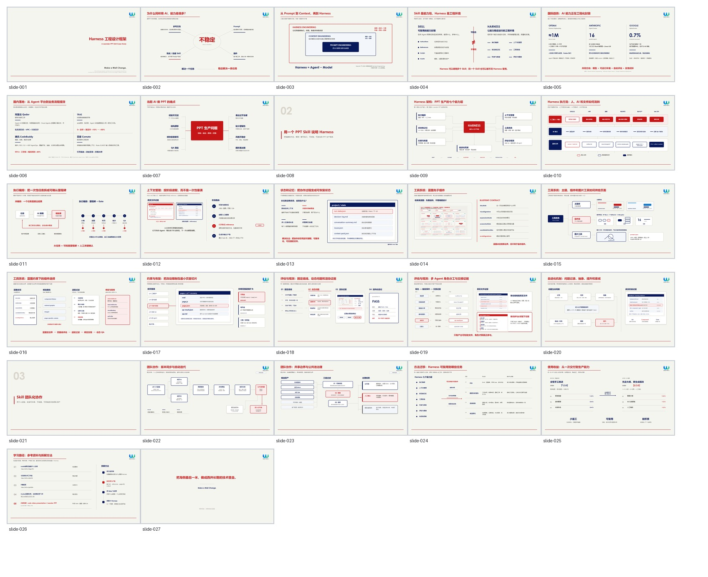
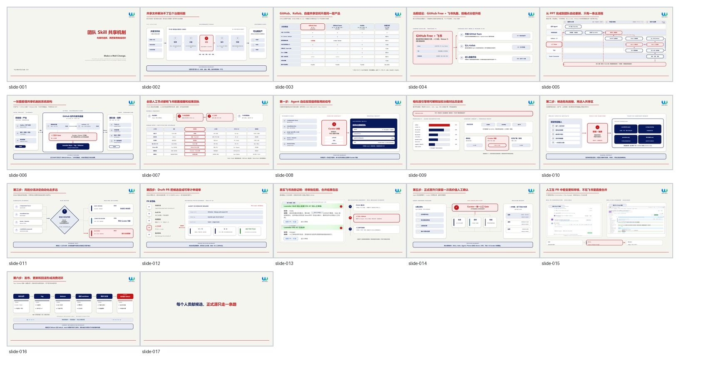
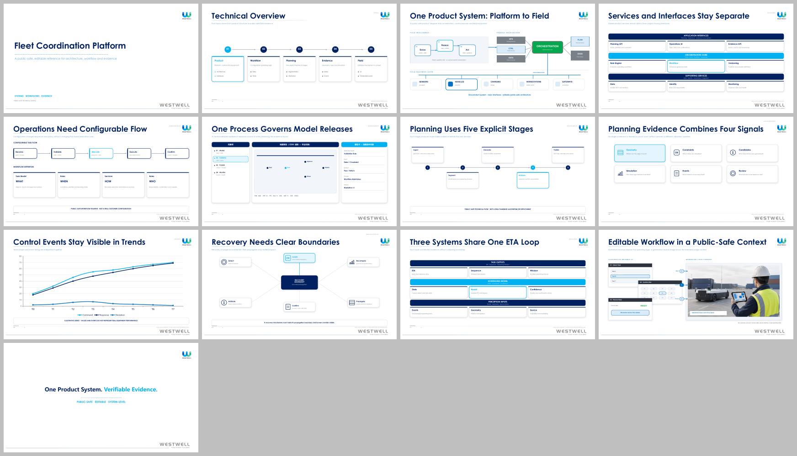

# Innovation-Products_ppt

`Innovation-Products_ppt` 是一套用于创建、重设计和规范化正式演示文稿的 Codex Skill。它以明确的阶段和用户确认点组织内容规划、视觉设计、页面生产与质量检查，最终交付标准、可编辑的 `.pptx`。

| 项目 | 说明 |
|---|---|
| 安装目录 | `innovation-products-ppt` |
| 调用方式 | `$innovation-products-ppt` |
| 当前版本 | `0.6.0-beta.27` |
| 公开主题 | `leander-base`、`base2`、`leander-global` |
| 主要输出 | 可编辑 PPTX、逐页渲染图与总览图 |

## 目录

1. [适用范围](#1-适用范围)
2. [安装与更新](#2-安装与更新)
3. [开始使用](#3-开始使用)
4. [制作流程与确认点](#4-制作流程与确认点)
5. [生产模式](#5-生产模式)
6. [主题选择与样张](#6-主题选择与样张)
7. [交付与后续修改](#7-交付与后续修改)
8. [版本历史](#8-版本历史)
9. [常见问题](#9-常见问题)

## 1. 适用范围

本 Skill 适用于：

- 根据文档、数据、访谈记录或结构化要点创建演示文稿；
- 对既有 `.pptx` 进行视觉重设计、结构调整或规范化处理；
- 制作内部汇报、管理报告、培训材料、客户演示和技术介绍；
- 对已完成的演示文稿进行局部修订，并保留未受影响页面；
- 在既定品牌边界内复用主题、组件和页面设计规则。

以下事项不在默认范围内：

- 未经确认直接复用参考 PPT 中的业务内容、图片或数据；
- 以静态图片替代可编辑 PowerPoint；
- 跳过用户确认点、渲染检查或终版核验后直接交付；
- 将流程检查机制理解为操作系统级安全沙箱。

## 2. 安装与更新

### 2.1 使用环境

正式制作 PPT 前，请确认：

- 已安装 Codex；
- 已安装 [Node.js LTS](https://nodejs.org/)；
- Windows 电脑已安装 Microsoft PowerPoint，用于渲染和视觉检查。

### 2.2 下载 Skill

第一次使用推荐下载 ZIP：

1. 打开 [Innovation-product 仓库](https://github.com/Westwell-IInnovation-Products/Innovation-product)。
2. 选择 **Code → Download ZIP**。
3. 解压后打开仓库文件夹；看到 `SKILL.md` 即表示已经位于完整 Skill 的根目录。

需要长期同步更新时，也可以使用 Git：

```powershell
git clone https://github.com/Westwell-IInnovation-Products/Innovation-product.git
```

### 2.3 安装到 Codex

将解压或克隆得到的仓库根目录复制到以下位置，并将目标文件夹命名为 `innovation-products-ppt`：

```text
%USERPROFILE%\.codex\skills\
```

正确的入口文件路径应为：

```text
C:\Users\你的用户名\.codex\skills\innovation-products-ppt\SKILL.md
```

仓库根目录就是 Skill 根目录，不需要再寻找 `innovation-products-ppt` 子目录。安装后的核心结构如下：

```text
innovation-products-ppt/
├── SKILL.md
├── README.md
├── agents/
├── references/
├── scripts/
└── templates/
```

也可以在已克隆的 `Innovation-product` 仓库根目录运行以下 PowerShell。该命令会先备份旧版本，再将仓库内容复制到本地 Skill 目录，并排除 Git 元数据：

```powershell
$repoRoot = (Resolve-Path .).Path
$skillsRoot = Join-Path $env:USERPROFILE ".codex\skills"
$skillTarget = Join-Path $skillsRoot "innovation-products-ppt"
$backupTarget = "$skillTarget.backup-$(Get-Date -Format yyyyMMdd-HHmmss)"

New-Item -ItemType Directory -Path $skillsRoot -Force | Out-Null
if (Test-Path -LiteralPath $skillTarget) {
  Move-Item -LiteralPath $skillTarget -Destination $backupTarget
}
New-Item -ItemType Directory -Path $skillTarget -Force | Out-Null
Get-ChildItem -LiteralPath $repoRoot -Force |
  Where-Object { $_.Name -ne ".git" } |
  Copy-Item -Destination $skillTarget -Recurse -Force
```

安装完成后重启 Codex，使其重新扫描本地 Skill。

### 2.4 验证安装

在 PowerShell 中确认入口文件存在：

```powershell
Test-Path -LiteralPath (Join-Path $env:USERPROFILE ".codex\skills\innovation-products-ppt\SKILL.md")
```

返回 `True` 后，在 Codex 中输入：

```text
请使用 $innovation-products-ppt，先帮我规划一份管理层汇报。
```

如果 Codex 先建立项目基线并与你确认需求和大纲，说明安装成功。

### 2.5 更新版本

ZIP 用户重新下载并解压仓库，再按第 2.3 节将仓库根目录复制到本地 Skill 目录。Git 用户先在仓库中执行：

```powershell
git switch main
git pull --ff-only origin main
```

随后重新执行第 2.3 节的备份与复制命令。不要只覆盖同名文件，否则新版本已删除的旧文件可能继续残留。

## 3. 开始使用

### 3.1 建议提供的信息

开始任务时，尽量说明：

- 受众与演示场景；
- 希望受众理解、相信或采取的行动；
- 必须出现和不得公开的内容；
- 可使用的文档、数据、图片、截图和参考 PPT；
- 语言、页数、演讲时长与交付时间；
- 希望采用的主题；不确定时可由 Codex 推荐。

信息不完整时，Codex 会先与你确认关键边界，不会直接进入全稿生产。

### 3.2 常用指令示例

创建新演示文稿：

```text
请使用 $innovation-products-ppt，把这些项目材料整理成一份 15 页左右的管理层汇报。
```

重设计现有 PPT：

```text
请使用 $innovation-products-ppt，重设计这份 PPT，保留事实内容和页序，先给我大纲与布局方案。
```

局部修改：

```text
第 4 页结论改为 X，第 6 页重新设计，其他页面保持不变。
```

指定主题：

```text
制作一份面向海外客户的英文技术介绍，采用 leander-global。
```

## 4. 制作流程与确认点

标准流程如下：

```text
需求与材料
  → Brief 与逐页大纲
  → 主题与布局蓝图
  → 2–3 页标杆样张
  → 选择生产模式
  → 全量生产
  → 渲染、检查与修复
  → 交付可编辑 PPTX
```

过程中设置四个用户确认点：

| 确认点 | 需要确认的内容 |
|---|---|
| 需求与大纲 | 目标、受众、页序、详略和必备内容是否正确 |
| 布局蓝图 | 页面结构、信息密度、图文关系和全稿节奏是否合理 |
| 标杆样张 | 主题、字体、颜色、排版和视觉完成度是否符合预期 |
| 生产模式 | 后续生产批次和反馈频率是否适合当前任务 |

每个确认点都会等待明确反馈。你可以批准继续，也可以直接指出要调整的页面、文案、结构或视觉方向。

## 5. 生产模式

| 模式 | 组织方式 | 适用情况 |
|---|---|---|
| Mode A：分批确认 | 每批完成 3–6 页并确认后继续 | 内容或视觉仍有不确定性，需要高频把关 |
| Mode B：顺序整片 | 样张确认后顺序完成全稿，再统一评审 | 主题和方向已经稳定；默认推荐 |
| Mode C：并行分章 | 章节分别生产后统一整合 | 长篇 Deck、章节边界明确且适合并行 |

无论采用哪种模式，终版均须完成渲染、视觉检查和可编辑性验证。

## 6. 主题选择与样张

当前分享版公开三个主题。PPT 可直接下载，完整样张总览直接展示在本节。

| 主题 | 适用场景 | 视觉特征 | PPT |
|---|---|---|---|
| `leander-base` | 常规内部汇报、管理沟通、方法介绍 | 暖米白底、藏青结构、Westwell 红信号色、克制线性布局 | [下载 27 页参考 PPT](docs/theme-samples/01-leander-base-reference.pptx) |
| `base2` | 机制说明、证据板、状态治理、决策路径 | Base 品牌语义、分级圆角、浅层面板、单层轻阴影 | [下载 17 页参考 PPT](docs/theme-samples/02-base2-reference.pptx) |
| `leander-global` | 对外、国际、客户与正式技术说明 | 白底、藏青结构、天蓝信号色、英文优先标题体系 | [下载 13 页分享样稿](docs/theme-samples/03-leander-global-sample-13p.pptx) |

### `leander-base`｜27 页参考 PPT



### `base2`｜17 页参考 PPT



### `leander-global`｜13 页分享样稿



`leander-base` 与 `base2` 是团队提供的参考材料，用于研究版式、密度、配色和图片布局；`leander-global` 是使用当前工作流制作的分享样稿。参考材料只用于主题选型与设计对照，不代表 Skill 会复用其中的业务内容。

## 7. 交付与后续修改

正式交付物是可编辑的 `.pptx`，通常位于项目的 `output/` 目录。项目还会保留逐页 PNG、总览图、质量检查结果和必要的来源记录。

后续修改可以继续使用自然语言：

- “第 4 页结论改为 X，其他页面不变。”
- “第 6 页流程关系不清楚，重新设计这一页。”
- “把整份 PPT 切换为 `leander-global`。”
- “新增一页说明实施路径。”

修订遵循最小影响原则：局部修改只重建相关页面；主题、共享组件或叙事结构发生变化时，才扩大复查范围。

## 8. 版本历史

| 版本 | 日期 | 主要变化 |
|---|---|---|
| `0.6.0-beta.27` | 2026-07-29 | 新增跨主题修改防漂移：视觉影响自动识别、共享主题/组件变更后的新鲜审批、Base2 线形融合与分角色阴影审计，以及通用卡片墙拦截。 |
| `0.6.0-beta.26` | 2026-07-29 | 修复 review 与 active 叠加造成的红卡蓝轨冲突，统一 blocked/high/current/Gate 危险语义，并增加小字号正文和卡内纵向空洞审计。 |
| `0.6.0-beta.25` | 2026-07-28 | 统一三套主题的 review/blocked 状态语义，修复 Global 阻断状态误用天蓝强调色，并增加跨主题回归测试。 |
| `0.6.0-beta.24` | 2026-07-28 | 恢复 Base2 状态轨、内嵌层与决策带语义，新增 `statusCard` 和 `base2GovernanceChain`，并锁定 review/blocked 状态回归。 |
| `0.6.0-beta.23` | 2026-07-28 | 修复封面、封底在强制重渲染后的主题审计输入摘要绑定，并增加对应回归测试。 |
| `0.6.0-beta.22` | 2026-07-28 | 修复 Windows/LibreOffice 零补位预览文件名导致的 Gate 1.5 校验问题。 |
| `0.6.0-beta.21` | 2026-07-28 | 增加内容层主题保真档案、Global 高容量工程页面模式、主题 QA 门禁和正反例测试。 |

完整中文变更记录见 [CHANGELOG.md](CHANGELOG.md)。后续每次发布都必须同步更新当前版本、发布日期、主要新增、修复内容和迁移影响。

## 9. 常见问题

### 安装后 Codex 没有识别

确认路径是：

```text
%USERPROFILE%\.codex\skills\innovation-products-ppt\SKILL.md
```

如果多了一层目录，请调整后重启 Codex。

### 制作过程中提示缺少依赖

确认已经安装 Node.js LTS 和 Microsoft PowerPoint，并重新启动终端与 Codex。

### 更新后仍出现旧行为

先备份并移走原安装目录，再复制完整的新版本。不要在旧目录上持续叠加覆盖。

### Git 下载失败

直接从 GitHub 仓库选择 **Code → Download ZIP**，不需要使用 GitHub CLI。

### 怎样确认正在使用这个 Skill

在任务中明确写出：

```text
请使用 $innovation-products-ppt。
```

正常情况下，Codex 会先处理需求和大纲，再进入布局、样张和全量生产。
