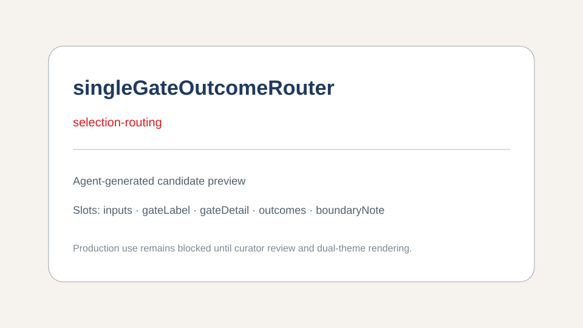

# singleGateOutcomeRouter

Route multiple evidence inputs through one decision boundary into three mutually exclusive outcomes.

## Layout preview

The preview shows the component's default visual hierarchy:

1. Three or four replaceable input cards on the left.
2. One emphasized decision gate in the center.
3. Three mutually exclusive outcome cards on the right.
4. A boundary note below the main route.

The third outcome uses the warning color only when it represents a blocking route. The other outcomes remain neutral so the diagram is not misread as three approval levels.

## Generic slots

| Slot | Purpose |
|---|---|
| `inputs` | Up to four evidence or signal cards |
| `gateLabel` | Main decision name |
| `gateDetail` | Short decision criterion or instruction |
| `outcomes` | Exactly three mutually exclusive results |
| `boundaryNote` | Clarifies what happens outside the component |

## Promotion evidence

- Two independently reviewed decision pages use one gate followed by three mutually exclusive outcomes.
- The relation generalizes to risk routing, content review, data admission and release decisions.
- The renderer contains only generic labels and theme-token-driven editable shapes.

This bundle is an agent-generated candidate. It is not production-ready until curator approval and dual-theme review.
