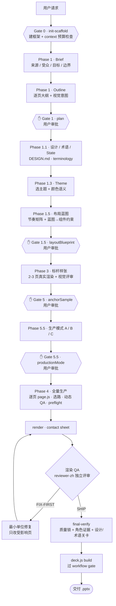

# Leander PPT · 目录说明(README)

本文件说明 `leander-ppt` 这个 skill 的文件夹结构,以及每个文件的作用,方便快速定位。

`leander-ppt` 是一套通过分阶段 harness 产出正式、可编辑 `.pptx` 的 skill。核心分工:

- **`SKILL.md`** = 路由/入口(每次先读)。
- **`references/`** = 分阶段的详细规则文档,由模型按当前阶段加载(是"散文规则")。
- **`templates/leander-ppt-scaffold/`** = 项目框架模板;每个新 deck 从这里复制出真实工作目录。其中 **`tools/`** 才是真正被 `node` 执行的代码。
- **`agents/`** = 事件触发的 subagent 角色人设。
- **`scripts/`** = skill 级脚本(初始化、同步、回归、发布检查)。

> 阅读约定:文件名、命令、JSON 字段、组件名等标识符保持英文;其余说明为中文。本文件反映当前快照,新增文件后可能需要补充。

## 结构速览

```text
leander-ppt/
├── SKILL.md                 路由 / 强制流程约束
├── CHANGELOG.md             版本变更
├── manifest.json            skill 清单元数据
├── README.md                本文件
├── agents/                  6 个 -zh 角色人设 + openai.yaml(Codex 界面配置)
├── references/              32 个分阶段规则文档(A 流程 / B 规划 / C 设计 / D 制作 / E 组件 / F QA / G 协作)
├── scripts/                 init / sync / regression / release-hygiene
└── templates/leander-ppt-scaffold/   项目框架模板
    ├── (根)                 deck.config.js · DESIGN.md · role-briefs.md · *.json · qa.md …
    ├── theme/               4 主题 tokens + assets/
    ├── components/          ppt-components / editorial / bespoke / icons …
    ├── tools/               ~55 个可执行工具(workflow / render / verify / qa …)
    ├── pages/               逐页文件夹(page.js · page.json · qa.md)
    ├── state/               轻量任务记忆
    ├── output/              生成物(运行时填充)
    └── agent-reviews/       角色评审证据(运行时填充)
```

---

## 运行流程

一次完整成片是一条**分阶段、带关卡**的流水线:每个阶段先产出便宜、可检查的产物,在四个 `✋` 检查点停下等用户确认,贵的渲染永远排在便宜的结构决策之后。



**图例:** `✋` = 停下等用户明确审批的检查点(用 `workflow-gate.js approve` 记录);其余为自动步骤或自动关卡。

贯穿全程的三条机制(图里没画,但一直在起作用):

- **唯一出片通路 + 硬关卡**:所有 `render / verify / build` 只走 `deck.js`,且必须持有有效 `workflow-receipt.json`,无法绕过(见 `HARD-GATE.md`)。
- **任务组合与预算**:标准 16–30 页 deck 先规划成约 4 个有界 job,根据真实 token 预测自适应扩到 3–6 个任务。累计量包含根任务及其后代子智能体;180K 停止开新重活、220K 只交接、260K 为合同硬顶。首轮默认 report-only,调用数/子智能体数只做观测。
- **反馈修复回路**:用户反馈走同一条"定位最小单位 → 只改受影响页 → 重渲 → 重跑 QA"的回路,共享 token/组件的改动才触发整片重渲。

---

## 整体设计思路

把"AI 一次性直出 PPT"改造成"像工程一样**分阶段、有关卡、有证据、可增量修复**的流水线"。用便宜的检查点和逐页隔离,在贵的渲染之前就锁住方向与质量。

1. **关卡式 harness,不是一次性生成器。** 出片被拆成 brief → 大纲 → 蓝图 → 锚点 → 生产 → QA 的阶段管道,每阶段先产出便宜、可检查的产物,并在四个检查点停下等确认。结构错了要在"画蓝图"时改,而不是等整片画完。

2. **稳定的是流程与证据,不是外观。** 框架固化的是工作流和证据链,不是页面长相。每份 deck 的故事线、密度、版式都从当前 brief/主题/素材重新推导,默认绝不照搬上一份 deck 的页面分配。

3. **逐页隔离。** 一页一个文件夹(`page.js` / `page.json` / `qa.md` / `out/`)。页面是最小的设计与修复单位:改一页只重渲一页,不重建整片,反馈成本被压到最低。

4. **以产物为门 / 证据支撑。** "完成"绑定到看得见的产物(`qa.md`、reviewer 结论块、渲染证据),没有产物 = 没做。每条 PASS 必须写明规则、位置、方法、观察,拒绝空泛证据。散文强制不了执行,就把"跳过 QA"变得可见。

5. **关系优先的视觉选择。** 先问"受众必须看到什么关系"(流程 / 状态 / 对比 / 层级 / 证据 / 场景…),再在四条路线(组件库 / 外部图 / image2 / 页面专属)里选表达,而不是按关键词硬套组件。

6. **语义化的颜色与留白 + 反 AI 味。** 颜色必须编码含义(同级同色、每页单一强调焦点)、正文要填满或居中、版式要随故事变化;评审专门排查"装饰性配色 / 不对称无用空白 / 千篇一律"这些 AI 生成痕迹。

7. **事件触发的多 agent 协作。** planner / layout / designer / curator / reviewer / presenter 由工作流事件触发,评审保持独立;主 agent 负责最终整合与对用户负责,不把责任下放给子代理。

8. **上下文与成本是一等公民。** 用少量 job 组合完整阶段,而不是把每个微步骤拆成根任务;按累计 token 在安全边界写 handoff,新任务用 `resume-job.js` 一键续做。调用次数不是质量门,相同事件摘要的重复评审才会被拒绝。

9. **自进化闭环。** 每轮反馈积累进 `LESSONS.md`,去标识、可复用的规则被提升为通用规则(并归档进 `LESSONS-ARCHIVE.md`);skill 越用越准。

---

## 顶层

| 文件 | 作用 |
|---|---|
| `SKILL.md` | **路由/入口**。强制流程约束、Phase Map、各阶段读哪个 reference、检查点与 gate。 |
| `CHANGELOG.md` | 版本变更记录。 |
| `manifest.json` | skill 清单元数据(名称/版本/入口)。 |
| `README.md` | 本目录说明。 |

## agents/ — 角色人设(事件触发的 subagent)

| 文件 | 作用 |
|---|---|
| `planner-zh.md` | 规划:故事、大纲、页面意图 |
| `layout-architect-zh.md` | 布局:整片节奏、布局约束 |
| `visual-designer-zh.md` | 视觉:锚点风格、颜色语义、排版、图片 |
| `component-curator-zh.md` | 组件:关系优先的组件复用、选路线、拒绝理由 |
| `reviewer-zh.md` | 审阅:渲染 QA、动态 QA、SHIP/FIX-FIRST(实跑的审阅员) |
| `presenter-zh.md` | 讲者:排练流、转场、观众困惑点、补充知识 |
| `openai.yaml` | agent 的 Codex/OpenAI 配置(角色→模型等) |

## references/ — 分阶段规则文档(按用途分组)

**A. 入口与流程治理**
| 文件 | 作用 |
|---|---|
| `HARD-GATE.md` | 硬 gate 强制约束(context 轮换 fail-closed 边界) |
| `SCAFFOLD.md` | 框架结构说明(逐页文件夹模型) |
| `FAST-RUN.md` | 快速运行/修复模式 + token 纪律 |
| `TOKEN-BUDGET.md` | 单任务 260K 预算、3–6 job 组合、report-only→enforce 上线规则 |
| `SCOPE-HYGIENE.md` | 范围卫生:不把项目事实泄漏进通用规则 |
| `STATE-MEMORY.md` | 轻量任务记忆(state/) |
| `SELF-EVOLUTION.md` | 自进化/学习闭环(教训如何积累、提升) |

**B. 内容与结构规划(Phase 1)**
| 文件 | 作用 |
|---|---|
| `BRIEF.md` | 需求 brief 规格(来源/受众/目标/边界) |
| `OUTLINE.md` | 大纲规格(逐页计划、被工具解析的输出模板) |
| `NARRATIVE-FRAMEWORK.md` | 叙事框架(大问题→环境→目标问题→方案→展开→实施效果) |
| `TERMINOLOGY.md` | 术语约束(一个概念一个名字) |
| `QUALITY-BASELINE.md` | 内容/视觉质量底线(字段填全≠内容充分) |

**C. 设计 / 主题 / 布局(Phase 1.1–1.5)**
| 文件 | 作用 |
|---|---|
| `DESIGN-SYSTEM.md` | 项目级设计系统 |
| `THEMES.md` | 主题与模板系统(现 4 个:Base / Base2 / Global / GlobalV2) |
| `VISUAL-COMPOSITION.md` | 视觉构图(让页面"是设计的"而非拼凑) |
| `LAYOUT-BLUEPRINT.md` | 布局蓝图 Gate 1.5(节奏矩阵 + 蓝图到组件约束) |

**D. 页面制作(Phase 3–4)**
| 文件 | 作用 |
|---|---|
| `SLIDE-CRAFT.md` | 幻灯片工艺(必读:决策树、颜色语义、填满正文、反 AI 味) |
| `PAGE-DESIGN-METHOD.md` | 页面设计方法(信息→关系→路线→产物真实性→版面结构→QA) |
| `VISUAL-SELECTION.md` | 视觉选路线(组件库/外部图/image2/自定义 四路线) |
| `PRODUCTION.md` | 生产模式 A/B/C + 最小单位修复 |

**E. 组件与图片**
| 文件 | 作用 |
|---|---|
| `COMPONENTS.md` | 组件库总览与政策(三层模型、外部库) |
| `COMPONENT-CATALOG.md` | 组件目录/选择菜单(~50 个组件 + 函数映射) |
| `COMPONENT-LIBRARY-DESIGN.md` | 组件库如何演进(元数据标准、注册表/渲染器/选择器约束、治理) |
| `IMAGE-ASSETS.md` | 图片预留槽位 + prompt 规格工作流 |

**F. QA 与质量**
| 文件 | 作用 |
|---|---|
| `QA.md` | QA 协议(渲染质量锁、完成的定义、审阅员约束) |
| `DYNAMIC-QA.md` | 页面专属的中文动态 QA |
| `QUALITY-LOCK.md` | 质量锁(省 token 的前置条件) |
| `LESSONS.md` | 活跃缺陷清单(一屏、每次都读) |
| `LESSONS-ARCHIVE.md` | 累积缺陷教训归档(去重全集) |

**G. 协作与产物**
| 文件 | 作用 |
|---|---|
| `AGENT-COLLABORATION.md` | 多 agent 事件触发协作机制 |
| `ROLE-GUIDANCE.md` | 角色指引(项目 `role-briefs.md` 怎么用) |
| `ARTIFACTS.md` | 产物标签(user-confirm / next-input / internal-evidence / final-output / archive-reference) |

## scripts/ — skill 级脚本(在 skill 根运行)

| 文件 | 作用 |
|---|---|
| `init-scaffold.js` | 建一个发布态干净框架、装锁定依赖、验证运行时、创建 Gate 0 |
| `sync-scaffold-tools.js` | 恢复已有项目时,只升级 skill 受管的 workflow 工具 |
| `regression-tests.js` | 共享 skill 的回归测试入口(隔离安装跑) |
| `release-hygiene.js` | 分发前校验:确保是干净的内部试用包(无泄漏) |

---

# templates/leander-ppt-scaffold/ — 项目框架模板

每个新 deck 从这里复制出一份真实工作目录。以下是模板自带的种子文件。

**根文件**
| 文件 | 作用 |
|---|---|
| `deck.config.js` | deck 配置(name/theme/fileName/workflow.stage/executionBudget/agentCollaboration) |
| `DESIGN.md` | 项目设计系统(模板) |
| `visual-direction.md` | 项目视觉 brief(模板) |
| `role-briefs.md` | 多 agent 的项目角色指引(模板) |
| `terminology.json` | 项目规范术语 |
| `quality-target.json` | 质量目标分数(各维度阈值) |
| `checkpoint-status.json` | 检查点审批状态 |
| `agent-collaboration.json` / `.md` | 机器可读 / 人类可读的角色证据 |
| `qa.md` | deck 级 QA 汇总(逐页表 + 审阅员结论) |
| `package.json` / `package-lock.json` | 依赖(pptxgenjs 等) |
| `.leander-scaffold-version.json` | 框架版本标记 |
| `.codexignore` / `.gitignore` | 忽略规则 |

## theme/ — 主题

| 文件 | 作用 |
|---|---|
| `tokens.js` | 主题注册表 + `getTheme()`(默认备用 Leander Base) |
| `leander-global.js` | Leander Global 主题(对外/国际/正式) |
| `base2.js` | Base2 主题:Base 的柔和纵深变体 |
| `global-v2.js` | GlobalV2 主题:工业/自动化技术风高键蓝白 |
| `theme.json` | 当前 deck 选定的主题记录 |
| `assets/logo-westwell.png` · `footer-westwell.png` | 品牌资产(logo / 页脚字标) |

## components/ — 组件库

| 文件 | 作用 |
|---|---|
| `ppt-components.js` | 主组件库 `makeComponents(pptx, theme)`(~50 内容组件 + chrome) |
| `editorial.js` | 编辑式 / 线框版式组件(lineCompare、zoneGrid…) |
| `bespoke.js` | 定制大图形隐喻组件("灵动感":hubRadial、goalPath…) |
| `icons.js` | 图标 helper(document/person/hub/chart… 图标集) |
| `tool-system-tree.js` | 工具系统树专用组件(toolSystemTree) |
| `harness-slides.js` | 讲解 Leander harness 本身的专用页组件 |
| `extensions/index.js` | 组件扩展注册入口 |
| `external-renders/` | 外部渲染源(ECharts/3D 等)存放目录 |

## tools/ — 可执行工具(按功能分组)

**工作流 & 硬 Gate**
| 文件 | 作用 |
|---|---|
| `workflow-gate.js` | 每个 deck 的强制工作流入口与阶段 gate(init/status/approve/migrate) |
| `run-phase.js` | 把确定性 phase 工作合并成一次模型可见调用 |
| `deck.js` | 页面 render / verify / build(唯一受 gate 出片通路) |
| `deck-ctx.js` | 构建 `{ ui, ed, bp, theme, pptx }` 上下文 |
| `phase-handoff.js` | Gate 边界的哈希绑定 handoff 数据包 |
| `task-portfolio.js` | 把完整 deck 规划为 3–6 个自适应根任务 job |
| `resume-job.js` | 新任务一键 attach、校验 handoff、生成严格 context pack、定位当前 job |
| `hard-gate-contract.js` | 防止误删硬 gate 强制调用点 |
| `hard-gate-blackbox.js` | 硬 gate 的进程级对抗黑盒冒烟测试 |
| `tool-freeze.js` | deck 运行期间冻结工作流机器 |
| `environment-doctor.js` | Gate 0 / 渲染前的本地运行时体检 |
| `toolchain.js` | 工具链探测 |

**Context / Token 治理**
| 文件 | 作用 |
|---|---|
| `context-budget-gate.js` | 按根任务+后代子智能体累计 total_tokens 评估执行/交接/硬顶水位 |
| `context-pack.js` | 默认严格、自动裁掉可选重读项的事件界定 context 数据包 |
| `token-ledger.js` | Gate 感知的 token 记账(分任务累计、主/子智能体拆分)+ 中文报告 |
| `rollout-usage.js` | 从本地 Codex rollout JSONL 读真实 token 用量 |

**视觉选路线 & 组件**
| 文件 | 作用 |
|---|---|
| `select-visual-route.js` | 关系优先的视觉选择器 V2(意图→候选→选路线) |
| `visual-selection-diversity.js` | 渲染前:防重复组件/重复几何 signature |
| `component-registry.json` | 组件注册表(语义/关系/标签/槽位/治理状态) |
| `component-index.min.json` | 紧凑组件索引(日常低 token 选组件) |
| `build-component-index.js` | 从注册表重建紧凑索引 |
| `enrich-component-registry.js` | 给注册表补齐可复用库元数据 |
| `component-contract.js` | Gate 1.5 组件约束:精确组件 ID 与自由构图提示分开 |
| `component-runtime.js` | 共享组件运行时自省(trace/绑定) |
| `compact-page-contract.js` | 把页面约束迁移到紧凑 V2 归属模型 |
| `lint-component-library.js` | 组件库维护 lint(语法/元数据/硬编码色) |
| `render-component-library-preview.js` | 渲染真实组件图册预览 |
| `render-component-shortlist-preview.js` | 在当前主题下渲染 Gate 1.5 候选组件短名单 |
| `verify-component-themes.js` | 合并真实渲染清单→组件双主题兼容元数据 |

**渲染 & 预览**
| 文件 | 作用 |
|---|---|
| `render-contact-sheet.js` | 从已渲染页面构建无依赖 SVG contact sheet |
| `render-diversity.js` | 渲染后的几何/留白多样性审计(低分辨率占用率特征) |
| `render-layout-blueprint.js` | 确定性低保真蓝图渲染器 |
| `render-risk.js` | 确定性风险分级(哪些页需要全尺寸评审) |
| `render-quality-gate.js` | 哈希绑定的渲染质量证据锁(capture/record/verify) |
| `blueprint-geometry.js` | 蓝图几何计算(拒绝非轴对齐线段等) |
| `zoom-crop.js` | 从渲染 PNG 裁剪+放大,做像素级缺陷复核 |

**校验 & Lint(设计关卡)**
| 文件 | 作用 |
|---|---|
| `verify-design-gates.js` | 设计硬关卡(outline/blueprint/pages 阶段) |
| `verify-checkpoints.js` | 阶段检查点 gate(phase4 等) |
| `verify-page-preflight.js` | 页面生产/渲染前的最终视觉约束 gate |
| `verify-agent-collaboration.js` | 校验真实角色运行是否匹配事件计划与独立性 |
| `verify-qa-result.js` | 校验有证据支撑的页面 QA(仅 Markdown PASS 不够) |
| `verify-quality-baseline.js` | 渲染/build 前校验可复用内容/视觉质量底线 |
| `verify-terminology.js` | 校验 deck 术语一致性 |
| `verify-state-memory.js` | 校验轻量 state/记忆产物 |
| `lint-layout-blueprint.js` | 蓝图节奏/形状类复用 lint |
| `lint-blueprint-preview.js` | Gate 1.5 预览安全 lint |
| `lint-scope-hygiene.js` | 范围卫生 lint(防项目事实泄漏) |

**QA / 产物 / 迁移 / 其他**
| 文件 | 作用 |
|---|---|
| `build-qa-profile.js` | 从规则集 ID + 页面风险生成紧凑中文 QA 约束 |
| `qa-batch.js` | 批量初始化/应用页面 QA,不丢弃仍有效的 PASS 证据 |
| `qa-evidence-index.js` | 压缩逐规则证据 digest,给增量 reviewer 提供轻量读取面 |
| `qa-rules.zh.json` | 中文 QA 规则集 |
| `artifact-map.js` | 产物清单映射(生成 artifact-manifest) |
| `page-digests.js` | 拆分的 render/selection/QA/source 摘要(非渲染元数据不使 PNG 失效) |
| `change-impact.js` | 变更影响分析(对比当前摘要与上次渲染集) |
| `issue-registry.js` | 结构化问题生命周期登记 |
| `plan-agent-events.js` | 产出事件摘要计划(有界的 Mode B 评审) |
| `migrate-agent-collaboration-v3.js` | 把历史协作证据迁移到 V3(不伪造评审) |
| `migrate-evidence-v2.js` | 对已 PASS 的旧证据做一次性迁移 |
| `regression-tests.js` | 框架内的回归套件(语法 + 确定性行为) |

## pages/ — 示例/种子页(逐页文件夹模型)

| 文件夹 | 内容 |
|---|---|
| `p01-cover/` | 封面示例页:`page.js`(构建)· `page.json`(约束)· `qa.md`(逐页结论) |
| `p02-values/` | 内容示例页:同上三件套 |

> 每张幻灯片一个文件夹,是最小的隔离、渲染与修复单位;渲染输出落在该页的 `out/<id>.png`。

## state/ — 轻量任务记忆

| 文件 | 作用 |
|---|---|
| `run-state.json` | 运行状态 |
| `decision-log.md` | 决策日志 |
| `conversation-summary.md` | 会话摘要 |
| `task-portfolio.json` | 3–6 个自适应根任务 job、当前 job 与 split 历史 |
| `context-budget.json` | 当前任务累计 token 水位与 would-rotate/enforce 决策 |
| `phase-handoff.json` | 新任务续做的哈希绑定最小数据包 |
| `feedback-log.md` | 项目本地原始反馈日志 |
| `issues.json` | 问题登记 |
| `page-memory/` | 逐页记忆(运行时填) |

## output/ · agent-reviews/

生成物(`.pptx`、`preview/`、contact sheet)与角色评审证据的输出目录,随运行填充。

---

## 速记

- **改规则** → 编辑 `references/*.md`(散文,模型读)。
- **改行为/机器逻辑** → 编辑 `templates/leander-ppt-scaffold/tools/*.js`(代码,被执行)。
- **改外观/主题** → `templates/leander-ppt-scaffold/theme/` 与 `components/`。
- **出片唯一通路** → `node tools/deck.js render|verify|build`,必须过 workflow gate。
