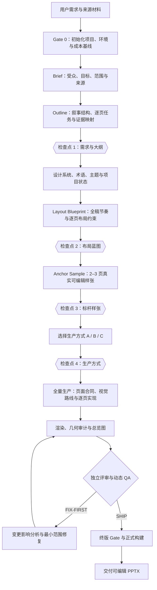

# Leander PPT

`leander-ppt` 是一套面向正式演示文稿生产的工程化 Skill。它将需求理解、叙事规划、视觉设计、页面实现、渲染评审和终版构建组织为一条可审查、可回溯、可增量修订的生产链，最终输出标准、可编辑的 `.pptx`。

当前团队分享版基于 `0.6.0-beta.20`，公开提供 `leander-base`、`base2`、`leander-global` 三个主题。

> 快速入口：[安装与首次使用](docs/GitHub-使用指南.md)

## 一、使用说明

### 1.1 适用任务

本 Skill 适用于以下类型的工作：

- 根据文档、数据、访谈记录或结构化要点创建新演示文稿；
- 对既有 `.pptx` 进行视觉重设计、结构调整或规范化处理；
- 制作内部汇报、管理报告、培训材料、客户演示和技术介绍；
- 对已生成演示文稿执行局部修订，并保留未受影响页面；
- 在既定品牌边界内复用主题、组件和页面设计规则。

下列情况不属于默认能力边界：

- 未经审批直接复制参考 PPT 中的业务内容、图片或数据；
- 以静态图片替代可编辑 PowerPoint，却仍将其描述为可编辑交付物；
- 绕过用户检查点、渲染 QA 或终版核验，直接声明正式交付完成；
- 将 Leander 的流程 Gate 误解为操作系统级安全沙箱。

### 1.2 使用前准备

正式使用前应具备以下条件：

- 已在 Codex 中安装本 Skill，具体步骤见[安装与首次使用](docs/GitHub-使用指南.md)；
- 本机存在可用的 Node.js 运行环境；
- 本机具备 PowerPoint 渲染能力，Windows 环境通常使用 Microsoft PowerPoint；
- 已提供受众、目标、场景、内容来源和交付边界；
- 如页面要求使用真实图片、截图、数据或业务证据，应提供相应素材或明确素材状态。

推荐在启动时说明：

- 谁将观看这份演示文稿；
- 演示发生在什么场景；
- 希望受众理解、相信或采取什么行动；
- 哪些事实必须出现，哪些内容不得公开；
- 是否存在既有模板、参考 PPT 或品牌规范；
- 页数、语言、演讲时长与交付时间是否有限制。

### 1.3 启动方式

使用者可以通过自然语言启动任务，例如：

- “使用 leander-ppt 将这份项目材料整理为管理层汇报。”
- “基于现有 PPT 重设计第 3、5、8 页，其他页面保持不变。”
- “制作一份面向海外客户的英文技术介绍，采用 `leander-global`。”

框架会先初始化标准项目目录并建立 Gate 0 基线，随后按照需求与大纲、设计系统、主题、布局蓝图、标杆样张和全量生产的顺序推进。

### 1.4 完整操作流程

Leander 采用“先语义、后结构；先约束、后实现；先代表性验证、后规模化生产”的渐进式流程。



各阶段的目标和主要产物如下：

| 阶段 | 核心问题 | 主要产物 |
|---|---|---|
| Gate 0 | 项目是否具备可重复运行的基线 | 标准项目目录、运行 ID、工具链指纹、Token 账本 |
| Brief | 为什么制作、面向谁、边界是什么 | `brief.md`、来源索引、原始消息快照 |
| Outline | 全稿讲述什么、各页承担什么任务 | `outline.md`、需求合同、页面映射 |
| 设计与主题 | 全稿采用何种视觉语言和术语体系 | `DESIGN.md`、`visual-direction.md`、术语表、主题记录 |
| Layout Blueprint | 页面结构、全稿节奏和视觉差异是否成立 | 布局蓝图、组件候选短名单、可选低保真预览 |
| Anchor Sample | 规划是否能转化为真实可编辑页面 | 2–3 页样张 PPTX、逐页 PNG、视觉评审 |
| Production | 如何实现全部活跃页面 | `page.js`、`page.json`、素材与逐页 QA |
| Render & QA | 当前页面是否达到交付要求 | PNG、总览图、几何报告、QA 证据 |
| Final Build | 正式 PPTX 是否与已评审版本一致 | 正式 PPTX 和终版回执 |

### 1.5 四个用户检查点

用户检查点用于确认具有主观判断或范围决策性质的产物。自动校验不能替代使用者确认。

| 检查点 | 审批对象 | 使用者应重点判断 |
|---|---|---|
| `plan` | Brief、大纲、需求合同 | 目标是否正确，页序与详略是否合理，必须内容是否完整 |
| `layoutBlueprint` | 全稿节奏、逐页布局签名、候选组件 | 页面关系是否清晰，相邻页面是否具有必要差异，信息密度是否可讲 |
| `anchorSample` | 2–3 页真实渲染样张 | 主题、字体、颜色语义、视觉完成度是否达到预期 |
| `productionMode` | 生产方式 A/B/C | 后续生产与反馈频率是否符合项目风险和时间安排 |

每个检查点都会停止并等待明确反馈。使用者可以批准继续，也可以直接指出需要修改的页面、结构、文案或视觉方向。

### 1.6 三种生产方式

三种生产方式只改变页面实现的组织方式，不降低终版质量要求。

| 模式 | 组织方式 | 适用条件 | 主要代价 |
|---|---|---|---|
| Mode A：分批确认 | 每批 3–6 页完成实现、渲染和反馈后再进入下一批 | 故事或视觉仍存在不确定性，需要高频人工把关 | 上下文与沟通往返较多 |
| Mode B：顺序整片 | 样张审批后由主 Agent 顺序完成全稿，再统一渲染与评审 | 主题、蓝图和样张已经稳定；为默认推荐模式 | 中间人工观察点较少 |
| Mode C：并行分章 | 在章节可独立切分时并行起草，主 Agent 统一整合 | 长篇 Deck、章节边界明确且存在可用子 Agent | 整合成本和跨章节一致性风险更高 |

Mode C 只能在标杆样张审批后启用。主 Agent 始终负责主题一致性、全稿整合、终版 QA 和用户沟通。

### 1.7 三个主题与关联材料

主题选择是对受众、信息密度、证据类型和品牌语义的综合约束。当前分享版公开三个主题，并将 PPT 与总览图一并放在仓库中。

| 主题 | 适用场景 | 视觉特征 | PPT | 总览图 |
|---|---|---|---|---|
| `leander-base` | 常规内部汇报、管理沟通、方法介绍 | 暖米白底、藏青结构、Westwell 红信号色、克制线性布局 | [下载 27 页参考 PPT](docs/theme-samples/01-leander-base-reference.pptx) | [查看整套总览图](docs/theme-samples/01-leander-base-contact-sheet.jpg) |
| `base2` | 机制说明、证据板、状态治理、决策路径 | Base 品牌语义、分级圆角、浅层面板、单层轻阴影 | [下载 17 页参考 PPT](docs/theme-samples/02-base2-reference.pptx) | [查看整套总览图](docs/theme-samples/02-base2-contact-sheet.jpg) |
| `leander-global` | 对外、国际、客户与正式技术说明 | 白底、藏青结构、天蓝信号色、英文优先标题体系 | [下载 13 页分享样稿](docs/theme-samples/03-leander-global-sample-13p.pptx) | [查看整套总览图](docs/theme-samples/03-leander-global-contact-sheet.png) |

`leander-base` 与 `base2` 的 PPT 是团队提供的参考材料，用于研究版式、密度、配色、图示和图片布局；`leander-global` 是使用当前工作流制作的 13 页分享样稿。参考材料用于主题选型和设计对照，不代表 Skill 会自动复刻其中的业务内容。

主题选择建议：

- 常规内部沟通优先 `leander-base`；
- 机制、证据、治理和状态类页面占比较高时优先 `base2`；
- 对外、国际或正式技术说明优先 `leander-global`。

只有在三个主题均不适用时，才建立项目专属主题。新主题必须定义字体、颜色语义、容器规则、标题系统、封面、封底和图片策略。

### 1.8 输出与修改方式

正式交付物是可编辑的 `.pptx`，通常位于项目 `output/` 目录。完整项目还会保留逐页 PNG、Deck 总览图、页面合同、QA 结果、来源记录和必要的流程回执。

修改时继续使用自然语言说明，例如：

- “第 4 页结论改为 X，其他页面不变。”
- “第 6 页流程关系不清楚，重新设计这一页。”
- “把整份 PPT 切换为 `leander-global`。”
- “新增一页说明实施路径。”

修订遵循最小影响原则：

- 文案、数据或局部构图变化：只修改并重渲染对应页面；
- 共享组件变化：重检调用该组件的页面；
- 主题 token 变化：重检受到相关 token 影响的页面；
- 叙事结构、页序或需求范围变化：重新打开规划阶段。

### 1.9 安装与分享材料目录

#### 使用者入口

| 内容 | 跳转 |
|---|---|
| 安装位置、下载方式和首次使用 | [GitHub 使用指南](docs/GitHub-使用指南.md) |
| 三个主题的 PPT 与总览图 | [主题样例目录](docs/theme-samples/) |

#### `docs/` 目录

```text
docs/
├── GitHub-使用指南.md
├── Git-操作说明.md
├── GitHub-assets/
│   ├── flow-overview.png
│   └── install-location.png
└── theme-samples/
    ├── 01-leander-base-reference.pptx
    ├── 01-leander-base-contact-sheet.jpg
    ├── 02-base2-reference.pptx
    ├── 02-base2-contact-sheet.jpg
    ├── 03-leander-global-sample-13p.pptx
    ├── 03-leander-global-contact-sheet.png
    ├── MANIFEST.sha256
    └── README.md
```

## 二、Skill 设计思路

### 2.1 设计目标与术语

Leander 不把 PPT 制作视为一次性生成任务，而是将其视为同时包含内容结构、视觉语法、可执行代码和质量证据的复合型交付过程。

框架采用三个基本原则：

1. **渐进式承诺**：先确认成本较低的语义与结构产物，再进入成本较高的页面实现和渲染；
2. **证据化关卡**：关键阶段形成可验证的产物、哈希和回执；
3. **最小影响修订**：页面作为独立生产单元，局部变更原则上只重建受影响页面。

主要术语如下：

| 术语 | 规范含义 |
|---|---|
| Deck | 一份完整演示文稿及其项目配置、来源、页面和质量证据 |
| Scaffold | 创建 Deck 时复制的标准项目框架 |
| Page Contract | 单页的机器可读约束，记录页面意图、视觉路线、素材需求和 QA |
| Gate | 阶段转换或正式构建前的阻断式校验 |
| Checkpoint | 需要使用者明确确认的阶段节点 |
| Receipt | 将审批、角色运行或终版构建与输入、产物和哈希绑定的回执 |
| Layout Blueprint | 正式绘制前的低保真布局约束 |
| Anchor Sample | 用于确认视觉方向的 2–3 个真实样张页面 |
| Visual Route | 共享组件、外部图形、Image2 或页面专属构图等表达路径 |
| Theme | 统一控制颜色、字体、容器、标题系统和品牌 chrome 的样式系统 |

### 2.2 总体架构

Leander 的总体架构可以理解为四层：

| 层级 | 主要对象 | 职责 |
|---|---|---|
| 需求与规划层 | Brief、需求合同、Outline、Layout Blueprint | 定义目标、范围、叙事和页面关系 |
| 设计与实现层 | Theme、Component、Page Contract、`page.js` | 将规划转化为可编辑页面 |
| 证据与治理层 | 来源索引、QA、几何审计、角色回执 | 证明当前页面与约束一致 |
| 构建与交付层 | `deck.js`、staging PPTX、正式 PPTX | 形成受控的最终交付物 |

页面是最小存储、渲染、评审和修复单元；主题、组件和工具是共享依赖。共享依赖变化时，影响分析会扩大需要重新验证的页面集合。

### 2.3 五项核心机制

#### 2.3.1 框架机制：逐页隔离与单一正式构建路径

##### 问题定义

如果整份 PPT 是唯一生产单元，页面代码、内容、素材和检查结果会相互耦合。局部修改容易触发全稿重建；如果渲染、验证和构建分散在多个脚本中，也容易产生未经验证的旁路产物。

##### 设计原则

框架采用“页级隔离、共享依赖显式化、正式输出单通路”的设计：

- 页面是最小存储、渲染、评审和修复单元；
- 主题、组件与工具作为共享依赖进行集中治理；
- 正式渲染、验证和构建统一经由 `tools/deck.js`；
- 阶段状态由结构化文件和回执表达。

##### 实现路径

每个页面目录至少包含：

```text
pages/<page-id>/
├── page.js
├── page.json
├── qa.md
├── qa-result.json
└── out/<page>.png
```

- `page.js` 负责生成可编辑 PowerPoint 对象；
- `page.json` 记录页面任务、视觉路线、素材需求和 QA Profile；
- PNG 与 QA 文件证明当前实现是否满足约束。

正式输出路径为：

```text
page.js
  -> deck.js render
  -> 页面 PNG 与几何审计
  -> deck.js verify / verify --final
  -> staging PPTX
  -> staging 重新渲染
  -> 与已评审 PNG 比较
  -> 正式 PPTX
```

页面代码、元数据、素材、主题、共享组件或渲染环境发生变化时，相关证据会失效并触发重新验证。

##### 机制价值与边界

该机制将局部修订从“整份重建”缩小为“影响集重建”，并使流程绕过在产物层面可见。但它不是操作系统级安全沙箱，不能阻止其他程序另行创建 PPTX。

#### 2.3.2 蓝图机制：在低成本阶段消除结构性风险

##### 问题定义

演示文稿的主要返工往往来自叙事顺序、页面任务、信息容量或视觉节奏的系统性偏差。如果所有页面完成后才发现问题，修订会同时影响内容、布局、组件和讲述逻辑。

##### 设计原则

蓝图机制包含两个层次：

1. **故事级约束**：明确章节在整体论证中的功能；
2. **页面级约束**：明确单页目的、关系类型、视觉签名、主要形状类别和组件候选。

蓝图不是缩小版成稿，也不是组件实现说明书。它只固定影响范围较大的结构决策，为后续视觉路线提供搜索边界。

##### 实现路径

大纲审批后，规划者建立：

- 故事节奏矩阵；
- 逐页意图卡；
- 布局 Signature 矩阵；
- 蓝图到组件的候选约束；
- 颜色语义与页面呼应关系；
- 高风险页面的可选低保真预览。

布局 Signature 至少回答：

- 页面承担什么叙事任务；
- 主要关系是流程、对比、层级、证据、状态还是空间结构；
- 视觉重心位于何处；
- 页面采用何种主要形状类别；
- 与前后页面形成连续、呼应还是对比；
- 为什么不能沿用相邻页面的同一结构。

对于超过 8 页、机制或架构页较多、视觉方向仍在塑造中的 Deck，布局蓝图为强制阶段。

##### 评价标准

相关工具检查：

- 页面约束是否完整；
- 相邻页是否过度重复；
- 单一形状类别是否在全稿中过量使用；
- 组件候选是否与关系、容量和主题兼容；
- 高密度页面是否给出合理依据；
- 蓝图预览是否存在越界、重叠或误导性表达。

##### 机制价值与边界

蓝图机制把结构性错误前移到易修改阶段，但不能替代真实渲染。字体宽度、图片裁切和像素层面的可读性仍须在样张与渲染阶段验证。

#### 2.3.3 组件机制：关系驱动的视觉路由与组件—主题分离

##### 问题定义

页面设计如果仅依赖关键词匹配，容易出现机械化表达。另一类问题是把内容结构与视觉外观写死在同一组件中，导致更换主题时必须复制或重写整套页面。

##### 设计原则

视觉决策拆分为三个层次：

1. **语义关系**：页面需要表达顺序、因果、层级、比较、证据还是状态变化；
2. **表达路线**：使用共享组件、外部图形、Image2 还是页面专属构图；
3. **视觉外观**：由主题 token 控制字体、颜色、容器、阴影、标题系统和品牌样式。

组件负责结构，主题负责视觉语法，页面合同负责记录选择理由。

##### 实现路径

视觉选择器依据下列信息生成并排序候选：

- 页面目的与关系类型；
- 内容槽位数量和文本容量；
- 组件候选与模式提示；
- 主题兼容性；
- 素材是否真实存在；
- 页面风险和候选置信差；
- 全稿中同类组件与形状的重复程度。

生产前比较四条路线：

| 路线 | 适用条件 | 核心要求 |
|---|---|---|
| `component-library` | 已有组件能准确表达页面关系 | 保持可编辑性，记录组件 ID 与数据绑定 |
| `external-graphic` | 地图、GIS、3D、真实截图等外部证据更合适 | 记录来源、版本和页面引用 |
| `image2` | 需要生成型视觉资产且不会冒充真实证据 | 先形成 Prompt 规格，明确真实性边界 |
| `page-specific-custom` | 共享组件无法表达该页独特关系 | 说明拒绝其他路线的理由，并限制在单页目录 |

当前组件库包含主组件、编辑式组件、定制构图和扩展组件，共计 76 个可执行组件。完整注册表用于治理，紧凑索引用于日常选择。

三个公开主题共享同一套内容组件，但通过不同 token 呈现不同标题系统、容器层级和品牌语义。页面不得为了模仿某个主题而在局部任意硬编码颜色或阴影。

##### 质量约束

- 关系与表达形式一致；
- 内容容量不超过组件安全范围；
- 色彩具有稳定语义；
- 同级对象使用一致编码；
- 全稿不存在大面积机械重复；
- 真实证据与生成内容可区分；
- 封面和封底遵守主题组件合同。

##### 机制价值与边界

组件复用不是目标本身。当共享组件不能准确表达页面关系时，应采用经过论证的页面专属构图，而不是为了组件覆盖率牺牲表达质量。

#### 2.3.4 进化机制：证据化质量治理与反馈闭环

##### 问题定义

演示文稿质量同时包含确定性问题和专业判断问题。文字溢出、图形越界可以由脚本发现；视觉重心、叙事清晰度和信息误导则需要基于真实渲染判断。只保留“已检查”的文字结论，无法证明结论针对当前版本。

##### 设计原则

质量治理采用“机器检查全覆盖、人工评审看真实像素、证据与版本哈希绑定”的原则。任何影响页面视觉或语义的变更，都会使相应证据失效并触发复核。

##### 实现路径

质量链包含：

1. 页面 Preflight；
2. 静态与几何审计；
3. 真实 PowerPoint 渲染；
4. 页面关系与风险驱动的动态 QA；
5. 独立审阅员给出 `SHIP` 或 `FIX-FIRST`；
6. 变更影响分析与最小范围修复；
7. 正式构建前的 staging 核验。

用户反馈按影响性质分为：

| 等级 | 含义 | 处理方式 |
|---|---|---|
| P0 硬错误 | 重叠、溢出、事实错误、结构画错 | 立即修复，并进入强制 QA 或工具规则 |
| P1 表达错误 | 页面关系、视觉路线或组件选择错误 | 修订页面路线，必要时更新组件元数据 |
| P2 设计质量问题 | 专业度不足、重复、颜色无语义、明显生成痕迹 | 更新设计规则、主题或组件 |
| P3 项目偏好 | 仅对当前项目或使用者有效 | 写入项目规则，不直接进入公共 Skill |

反馈生命周期为：

```text
new -> active -> promoted -> stable -> archived
```

- `new`：进入项目反馈日志；
- `active`：重复出现或具有明确通用性，进入当前检查集；
- `promoted`：落实到 QA、设计规则、组件或工具代码；
- `stable`：经过多个项目验证后不再作为高频提醒；
- `archived`：保留历史依据，但不进入默认上下文。

反馈进入公共 Skill 前必须完成抽象：项目事实不得被误写为通用规则；单页特例不得扩散为全局约束；组件缺陷应优先修复组件。

##### 机制价值与边界

该机制使“完成”成为可验证状态，并避免反馈日志无限增长。人工评审可以把机器 PASS 升级为 `FIX-FIRST`，但不能以自然语言覆盖机器 FAIL。

#### 2.3.5 多角色机制：专业分工、独立评审与单一责任

##### 问题定义

同一执行者同时承担规划、设计、实现和自我验收，容易产生确认偏差；多个角色分别控制不同版本，又会造成责任分散、主题分叉和整合困难。

##### 设计原则

Leander 采用“专业判断分离、角色按事件触发、主 Agent 保持单一责任”的协作结构。角色是工作流中的评审或决策节点，不是各自独立制作整份 PPT 的平行团队。

##### 角色模型

| 角色 | 触发事件 | 主要职责 | 不得替代 |
|---|---|---|---|
| `planner-zh` | 故事或布局变化 | Brief、大纲、叙事结构、全稿布局蓝图 | 用户审批、视觉终审 |
| `visual-designer-zh` | 设计、主题变化或高视觉风险 | 主题语义、样张风格、排版和图片策略 | 业务事实判断 |
| `component-curator-zh` | 组件变化或选择置信度低 | 组件候选、路线冲突和共享组件治理 | 页面终版验收 |
| `reviewer-zh` | 页面或全稿已渲染 | 基于真实渲染执行独立 QA | 自行修改后为自己背书 |

主 Agent 负责：

- 保持需求、主题和全稿结构一致；
- 决定何时触发专业角色；
- 整合角色意见并处理冲突；
- 组织页面生产；
- 管理用户检查点；
- 完成终版验证和用户沟通。

每次真实角色运行应绑定任务标识、工作流事件、输入摘要、输出文件和哈希。相同阶段中，如果事件摘要没有变化，应复用现有结论；只有输入发生真实变化时才重新运行。

##### 与生产方式的关系

Mode A/B/C 决定页面如何生产，不决定角色是否有效。标准 Mode B 通常包含一次标杆样张视觉评审和一次全稿独立终审；修复后只复审变化页面。Mode C 中的章节生产者仍不是最终审阅员。

##### 机制价值与边界

事件驱动避免无差别调用全部角色，降低重复成本；独立评审降低自我确认偏差；单一责任确保最终决策可追溯。若宿主不支持真实子 Agent，可以由主 Agent 按角色要求执行备用评审，但必须记录备用原因。

### 2.4 五项机制的依赖关系

| 上游机制 | 为下游提供的条件 |
|---|---|
| 框架机制 | 页级隔离单元、共享依赖和可哈希产物 |
| 蓝图机制 | 页面关系、视觉签名和组件候选边界 |
| 组件机制 | 将页面关系转化为可编辑实现 |
| 进化机制 | 验证当前实现并把缺陷转化为规则 |
| 多角色机制 | 为规划、设计和质量提供专业且相对独立的判断 |

任何一项机制都不能独立保证交付质量。组件正确不代表叙事正确；蓝图合理不代表真实渲染无问题；机器审计通过也不代表页面语义清晰。

### 2.5 Skill 内部目录

```text
leander-ppt/
├── SKILL.md
├── README.md
├── CHANGELOG.md
├── manifest.json
├── docs/
├── agents/
├── references/
├── scripts/
└── templates/leander-ppt-scaffold/
```

| 路径 | 职责 |
|---|---|
| `SKILL.md` | Skill 入口、阶段路由和强制约束 |
| `README.md` | 面向使用者和维护者的总体说明 |
| `CHANGELOG.md` | 版本变更记录 |
| `manifest.json` | 名称、版本、入口和分发元数据 |
| `docs/` | 安装、Git 操作和主题样例 |
| `agents/` | 四个中文专业角色及配置 |
| `references/` | 34 份分阶段方法、规则和质量文档 |
| `scripts/` | 初始化、同步、回归测试和发布检查 |
| `templates/leander-ppt-scaffold/` | 新 Deck 的可执行项目模板 |

### 2.6 `references/` 设计文档

#### 流程治理

| 文件 | 主要内容 |
|---|---|
| `HARD-GATE.md` | Gate、不变量、支持边界和对抗回归 |
| `SCAFFOLD.md` | 逐页文件夹模型、共享依赖和正式输出路径 |
| `FAST-RUN.md` | 已有项目恢复和最小上下文修复 |
| `TOKEN-BUDGET.md` | 单任务模式和 Token 成本度量 |
| `STATE-MEMORY.md` | 项目状态和会话恢复 |
| `SCOPE-HYGIENE.md` | 防止项目事实进入通用 Skill |
| `REQUIREMENTS-TRACE.md` | 原始需求合同和覆盖证据 |

#### 内容规划

| 文件 | 主要内容 |
|---|---|
| `BRIEF.md` | 受众、目标、来源和边界 |
| `OUTLINE.md` | 逐页计划、证据和视觉意图 |
| `NARRATIVE-FRAMEWORK.md` | 问题、环境、方案、机制和效果的叙事结构 |
| `TERMINOLOGY.md` | 术语唯一性和全稿一致性 |
| `QUALITY-BASELINE.md` | 内容充分性、真实性和可讲性 |

#### 设计与生产

| 文件 | 主要内容 |
|---|---|
| `DESIGN-SYSTEM.md` | 项目设计系统 |
| `THEMES.md` | 三个公开主题和选择规则 |
| `VISUAL-COMPOSITION.md` | 构图、视觉重心、层级和留白 |
| `LAYOUT-BLUEPRINT.md` | 故事节奏、布局签名和蓝图 Gate |
| `SLIDE-CRAFT.md` | 标题、颜色语义、密度和幻灯片工艺 |
| `PAGE-DESIGN-METHOD.md` | 从信息关系到视觉实现的方法 |
| `VISUAL-SELECTION.md` | 四类视觉路线及选择证据 |
| `PRODUCTION.md` | Mode A/B/C 与最小范围修复 |
| `REVISION-MODE.md` | 既有 Deck 的增量修订 |
| `IMAGE-ASSETS.md` | 图片槽位、真实素材和 Prompt 规格 |

#### 组件、QA 与协作

| 文件 | 主要内容 |
|---|---|
| `COMPONENTS.md` | 组件类型、来源和维护边界 |
| `COMPONENT-CATALOG.md` | 可复用组件目录和函数映射 |
| `COMPONENT-LIBRARY-DESIGN.md` | 组件元数据、注册表和治理 |
| `QA.md` | 渲染 QA 和审阅证据 |
| `DYNAMIC-QA.md` | 页面关系与风险驱动的 QA |
| `QUALITY-LOCK.md` | 不得压缩的质量节点 |
| `LESSONS.md` | 当前高频缺陷 |
| `LESSONS-ARCHIVE.md` | 稳定或历史教训 |
| `SELF-EVOLUTION.md` | 反馈分级、提升和归档 |
| `AGENT-COLLABORATION.md` | 事件驱动的多角色协作 |
| `ROLE-GUIDANCE.md` | 项目角色要求 |
| `ARTIFACTS.md` | 用户确认、内部证据和正式输出标签 |

### 2.7 Scaffold 结构

#### 项目根文件

| 文件 | 职责 |
|---|---|
| `deck.config.js` | Deck 名称、类型、主题、输出路径和工作流事件 |
| `DESIGN.md` | 当前 Deck 的设计系统 |
| `visual-direction.md` | 当前项目的视觉方向和素材策略 |
| `role-briefs.md` | 四个专业角色的项目要求 |
| `terminology.json` | 项目规范术语 |
| `quality-target.json` | 内容与视觉质量阈值 |
| `checkpoint-status.json` | 用户检查点状态 |
| `agent-collaboration.json/.md` | 角色事件与评审证据 |
| `source-evidence-index.json` | 来源、边界与内容哈希 |
| `qa.md` | Deck 级 QA 汇总 |

#### `theme/`

- `tokens.js`：三个公开主题的注册入口，默认主题为 `leander-base`；
- `base2.js`：Base2 的圆角、阴影和语义 token；
- `leander-global.js`：Global 的国际化标题和蓝色语义；
- `theme.json`：当前 Deck 的主题记录；
- `assets/`：Logo 和页脚等品牌资产。

#### `components/`

- `ppt-components.js`：主组件与主题 chrome；
- `editorial.js`：编辑式、线框式页面组件；
- `bespoke.js`：复杂关系和大型视觉构图；
- `icons.js`：主题感知图标；
- `extensions/`：组件扩展；
- `external-renders/`：地图、图表、3D 等外部渲染结果。

#### `tools/`

Scaffold 包含约 70 个 JavaScript 工具，主要分为：

| 类别 | 代表工具 | 职责 |
|---|---|---|
| 工作流与 Gate | `workflow-gate.js`、`run-phase.js`、`deck.js` | 阶段转换和正式构建 |
| 上下文与成本 | `context-pack.js`、`token-ledger.js` | 最小读取集和 Token 度量 |
| 需求与来源 | `requirements-trace.js`、`verify-source-evidence.js` | 需求覆盖和来源哈希 |
| 组件与视觉路由 | `select-visual-route.js`、组件注册表 | 候选选择和组件治理 |
| 蓝图与渲染 | `render-layout-blueprint.js`、`render-contact-sheet.js` | 蓝图预览和总览图 |
| QA 与审计 | `verify-page-preflight.js`、`render-quality-gate.js` | 页面前检、几何证据和动态 QA |
| 影响与修订 | `change-impact.js`、`revision-mode.js` | 影响集和增量修订 |
| 角色与产物 | `plan-agent-events.js`、`artifact-map.js` | 角色事件和产物标签 |
| 回归与维护 | `regression-tests.js`、各类 lint | 行为回归和范围卫生 |

#### 运行目录

| 目录 | 职责 |
|---|---|
| `pages/` | 逐页代码、合同、QA 和隔离渲染 |
| `state/` | 运行状态、需求合同、Token 账本、回执和反馈 |
| `output/` | PPTX、PNG、总览图和构建证据 |
| `agent-reviews/` | 规划、视觉、组件和审阅角色的输出 |

### 2.8 维护与验证

修改边界：

| 修改目标 | 主要位置 |
|---|---|
| 阶段方法和文字规则 | `references/*.md` |
| 强制入口与路由 | `SKILL.md` |
| 可执行行为 | `templates/leander-ppt-scaffold/tools/*.js` |
| 主题外观 | `theme/` 与主题感知组件 |
| 共享组件 | `components/`、注册表和元数据 |
| 单页专属实现 | 对应 `pages/<page-id>/` |
| 项目事实和反馈 | 当前 Deck 的 `source/`、`state/` 和页面目录 |

公共 Skill 不得吸收具体项目名称、客户事实、未授权素材或本机绝对路径。

修改后在 Skill 根目录执行：

```powershell
node .\templates\leander-ppt-scaffold\tools\regression-tests.js
node .\templates\leander-ppt-scaffold\tools\lint-scope-hygiene.js --skill-root .
node .\scripts\release-hygiene.js
```

主题注册检查：

```powershell
node -e "const {themes}=require('./templates/leander-ppt-scaffold/theme/tokens'); console.log(Object.keys(themes))"
```

分享版预期输出：

```text
leander-base
base2
leander-global
```

组件注册表发生变化时执行：

```powershell
node .\templates\leander-ppt-scaffold\tools\build-component-index.js
node .\templates\leander-ppt-scaffold\tools\lint-component-library.js --strict
```

正式出片统一使用：

```powershell
node tools/deck.js render
node tools/deck.js verify --final
node tools/deck.js build
```
