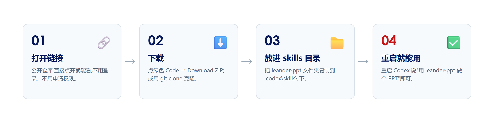
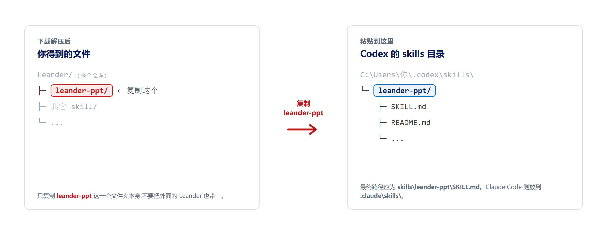

# GitHub 使用指南 —— 怎么拿到并安装 Leander PPT

这份指南写给**没怎么用过 GitHub 的同事**。目标很简单:把 `leander-ppt` 这个 skill 从 GitHub 拿到你自己的电脑上,装好,让 Codex 能用它做 PPT。

全程用大白话,按步骤走即可。默认你用的是 **Windows** 电脑。

项目地址(仓库):<https://github.com/Westwell-IInnovation-Products/Leander/tree/main/leander-ppt>

> 这是一个**公开仓库**,任何人打开链接就能看、能下载,不需要申请权限、也不用先登录。

---

## 先花一分钟弄懂几个词

- **GitHub**:一个存放和分享代码 / 文件的网站。可以理解成"一个带版本记录的在线文件夹",别人放上去,你能看、能下载。
- **仓库(Repository,简称 repo)**:GitHub 上的一个项目文件夹。我们这个仓库叫 `Leander`,里面放了好几个 skill,`leander-ppt` 是其中一个子文件夹。
- **skill**:给 Codex 用的一套能力包。把它放进指定目录,AI 就"学会"了这套本事。这里要装的就是 `leander-ppt`。
- **克隆(clone)/ 拉取(pull)**:clone 是"把整个仓库下载到本地";pull 是"把别人后来的更新同步下来"。后面会用到,不急着记。

---

## 整体就四步



一句话:**打开链接 → 下载 → 把 `leander-ppt` 文件夹放进 skills 目录 → 重启就能用。** 下面是每一步的细节。

---

## 第一步:在网页上打开看一眼

直接点开项目地址,你会看到 `leander-ppt` 文件夹里的内容,其中:

- **`README.md`** 会自动显示在页面下方,是这个 skill 的完整说明(它是什么、怎么用、内部怎么跑、每个文件干嘛)。**建议先读它。**
- `docs/theme-samples/` 里有三个主题的总览图和参考 PPT,想看主题长什么样可以点进去。

因为是公开仓库,这一步不需要登录。

---

## 第二步:把文件下载到本地(两种方式,挑一种)

### 方式 A:下载 ZIP(最简单,推荐第一次用)

不需要安装任何软件。

1. 在仓库页面,点右上方绿色的 **`Code`** 按钮。
2. 在弹出的小窗里点 **`Download ZIP`**。
3. 浏览器会下载一个压缩包(整个 `Leander` 仓库,不只是 `leander-ppt`)。
4. 找到下载的压缩包,右键 **解压到当前文件夹**。
5. 解压后进到文件夹里,你会看到 `leander-ppt` 这个子文件夹——**它就是我们要装的东西**。

> 缺点:以后有更新,得再下一次 ZIP、再覆盖一遍。偶尔用可以接受。

### 方式 B:用 Git 克隆(以后想方便地更新,用这个)

适合以后会经常同步更新的人。要先装一个叫 **Git** 的小工具。

1. 去 <https://git-scm.com/download/win> 下载 Git for Windows,一路默认安装。
2. 在你想放代码的目录(比如 `D:\work`)空白处右键,选 **Open Git Bash here**(或打开终端 / PowerShell)。
3. 输入下面这条命令,把整个仓库克隆下来:

```bash
git clone https://github.com/Westwell-IInnovation-Products/Leander.git
```

4. 完成后,当前目录下就多了一个 `Leander` 文件夹,里面就有 `leander-ppt`。

以后想同步最新版,进到 `Leander` 文件夹里执行:

```bash
git pull
```

---

## 第三步:把 skill 装进去(关键一步)

Codex 只认一个固定的 **skills 目录**。你要做的,就是把上一步得到的 `leander-ppt` 文件夹,复制到这个目录里。



```text
%USERPROFILE%\.codex\skills\
```

> `%USERPROFILE%` 就是你的用户主目录,一般是 `C:\Users\你的用户名`。把上面这串直接粘进文件资源管理器的地址栏,回车就能打开(`.codex` 是隐藏文件夹,用地址栏进去最省事)。如果 `skills` 文件夹不存在,自己新建一个即可。

**复制**:把 `leander-ppt` 整个文件夹,拖 / 复制到上面的 `skills\` 目录下。装好后应该是这样:

```text
C:\Users\你的用户名\.codex\skills\leander-ppt\
    ├── SKILL.md
    ├── README.md
    ├── agents\
    ├── references\
    ├── scripts\
    └── templates\
```

> 注意:复制的是 `leander-ppt` **这个文件夹本身**,不要把它外面那层 `Leander` 仓库文件夹也一起塞进去。最终路径必须是 `skills\leander-ppt\SKILL.md`,而不是 `skills\Leander\leander-ppt\SKILL.md`。

---

## 第四步:装好之后,做点准备再用

这个 skill 做 PPT 时,要在本机跑一点程序、还要把页面渲染成图来检查。所以第一次用之前,确认两样东西:

- **装了 Node.js**:去 <https://nodejs.org> 下载 LTS 版,一路默认安装。(它画页面、做检查的代码是用 Node 跑的。)
- **装了 PowerPoint**(Windows 上):它需要把做好的页面转成图片,自己看图检查排版。

> 这两样通常公司电脑本来就有 / 很好装。装 skill 本身不需要它们,但**真正开始做 PPT 时会用到**。

---

## 第五步:确认能用了

1. **重启** Codex(让它重新扫描 skills 目录)。
2. 直接说一句你要做的事,比如:

   > 帮我用 leander-ppt 做一份关于 XX 的汇报 PPT。

3. 如果它开始进入流程(先搭工作框架、问你要点、给你看大纲),就说明装好了。

具体怎么配合它一步步做(它中途会停下来让你确认几次、每次确认什么),看 `leander-ppt/README.md` 里的 **"一、使用说明"** 那一节。

---

## 以后怎么更新

- 用**方式 A(ZIP)**的:重新下载一次 ZIP,解压,把新的 `leander-ppt` 文件夹覆盖到 skills 目录里。
- 用**方式 B(Git)**的:进 `Leander` 文件夹执行 `git pull`,再把更新后的 `leander-ppt` 覆盖到 skills 目录里。

覆盖前,如果你自己在里面改过东西,先备份一下再覆盖。

---

## 遇到问题怎么办

- **装好了但 AI 没反应**:检查路径是不是 `skills\leander-ppt\SKILL.md`(别多一层文件夹),然后重启 Codex。
- **做 PPT 中途报错**:多半是没装 Node.js 或没装 PowerPoint,回到第四步补上。
- **`git clone` 很慢或失败**:改用方式 A 下载 ZIP;或检查网络。
- **其它**:直接问把这份材料发给你的人,或在团队群里问。

> 小结:**打开链接 → 下载 → 把 `leander-ppt` 文件夹放进 skills 目录 → 装 Node.js 和 PowerPoint → 重启 → 开说。** 就这么几步。

如果你需要提交修改、创建分支、发 Pull Request、打版本标签或回滚,请继续看 [`Git-操作说明.md`](Git-操作说明.md)。
